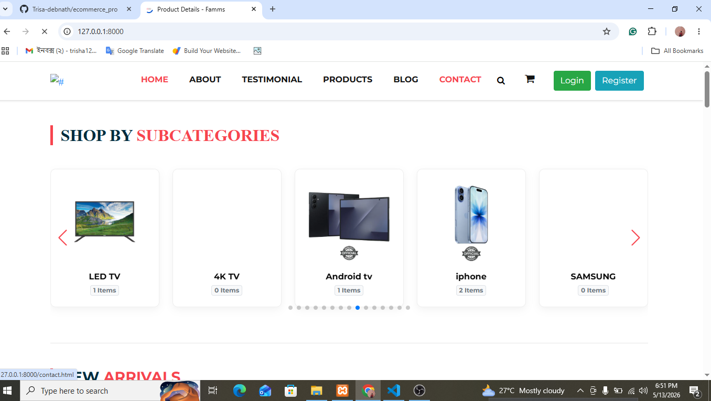
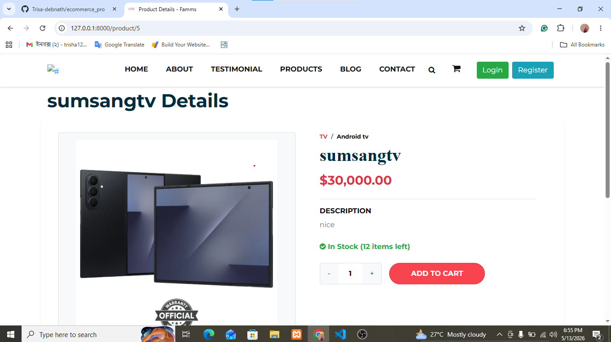
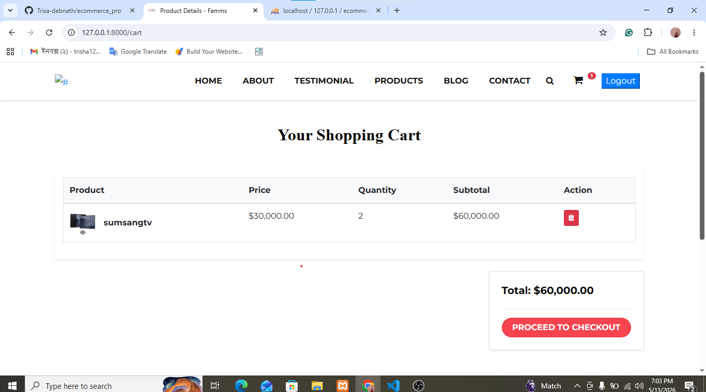
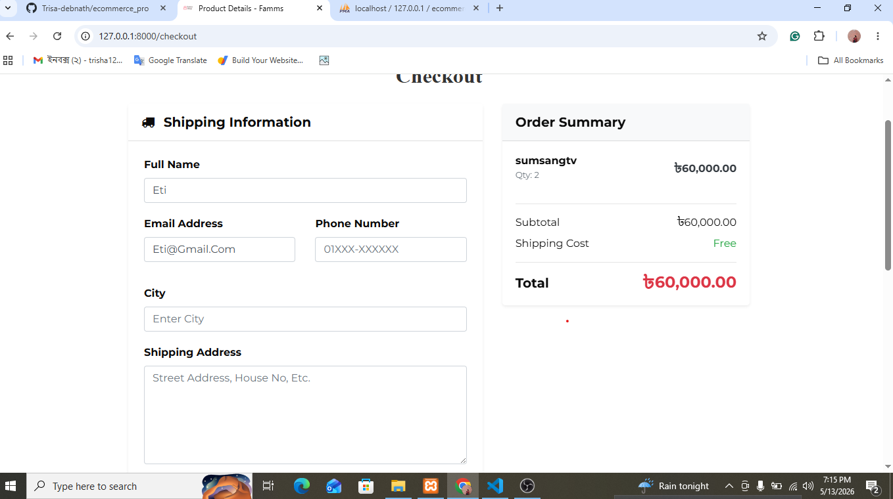

# Ecommerce Pro

Ecommerce Pro is a full-stack ecommerce web application built with Laravel. It includes a customer-facing storefront, product browsing, cart and checkout flow, authentication, and an admin dashboard for managing categories, subcategories, products, orders, and testimonials.

This project was built by **Trisa Debnath** as a complete ecommerce management system using Laravel, Livewire Volt, Blade, Tailwind CSS, Bootstrap, and MySQL/SQLite supported Laravel database configuration.

## Project Preview

 `Some screenshots ecommerce pro website output` 







## Features

- Customer home page with product listing
- Product search
- New arrivals product page
- Category and subcategory based product browsing
- Product details page with price, discount, stock, and description
- Session based shopping cart
- Add to cart, remove from cart, and cart total calculation
- Auth protected checkout system
- Cash on delivery and online payment method selection UI
- Order creation with order details
- User registration, login, email verification ready flow, and profile management
- Role based access control for admin and customer users
- Admin dashboard
- Category CRUD
- Subcategory CRUD
- Product CRUD with image upload
- Dynamic subcategory loading for product forms
- Product discount price calculation
- Order list, order details, payment status update, and order status update
- Testimonial management
- Responsive storefront layout
- Admin panel template with Bootstrap, jQuery, charts, icons, and UI plugins

## Tech Stack

**Backend**

- PHP 8.2+
- Laravel 11
- Laravel Breeze
- Laravel Tinker
- Livewire 4
- Livewire Volt
- Eloquent ORM
- Laravel Middleware
- Laravel Validation
- Laravel Session

**Frontend**

- Blade templates
- Livewire Volt components
- Tailwind CSS
- Bootstrap
- Alpine.js
- Vite
- Axios
- jQuery
- Font Awesome
- SweetAlert style event integration

**Database**

- MySQL or SQLite
- Laravel migrations
- Eloquent relationships

**Development and Testing**

- Composer
- NPM
- Vite
- Pest
- PHPUnit
- Laravel Pint

## Main Modules

### Customer Side

- Home page
- About page
- Product listing
- New arrivals
- Product details
- Cart
- Checkout
- Order success page
- Authentication pages
- Profile page

### Admin Side

- Dashboard
- Category management
- Subcategory management
- Product management
- Order management
- Testimonial management

## Database Tables

The project includes migrations for:

- users
- cache
- jobs
- categories
- sub_categories
- products
- orders
- order_details
- testimonials

## Important Routes

### Public and Customer Routes

| Method | Route | Description |
| --- | --- | --- |
| GET | `/` | Home page |
| GET | `/about` | About page |
| GET | `/new-arrivals` | New arrivals page |
| GET | `/testimonial` | Testimonial page |
| GET | `/product/{id}` | Product details |
| GET | `/subcategory/{id}/products` | Products by subcategory |
| GET | `/cart` | Shopping cart |
| GET | `/checkout` | Checkout page |
| GET | `/order-success/{order_id}` | Order success message |
| GET | `/dashboard` | Customer dashboard |
| GET | `/profile` | User profile |

### Admin Routes

| Method | Route | Description |
| --- | --- | --- |
| GET | `/admin/dashboard` | Admin dashboard |
| GET | `/admin/category` | Manage categories |
| GET | `/admin/category/create` | Create category |
| GET | `/admin/subcategory/manage` | Manage subcategories |
| GET | `/admin/subcategory/create` | Create subcategory |
| GET | `/admin/product` | Manage products |
| GET | `/admin/product/create` | Create product |
| GET | `/admin/orders` | Manage orders |
| GET | `/admin/orders/{id}` | View order details |
| GET | `/admin/testimonials` | Manage testimonials |
| GET | `/admin/testimonials/create` | Create testimonial |

## Installation

Follow these steps to run the project locally.

### 1. Clone the repository

```bash
git clone https://github.com/Trisa-debnath/ecommerce_pro
cd ecommerce_pro
```

### 2. Install PHP dependencies

```bash
composer install
```

### 3. Install Node dependencies

```bash
npm install
```

### 4. Create environment file

```bash
cp .env.example .env
```

For Windows PowerShell:

```powershell
Copy-Item .env.example .env
```

### 5. Generate application key

```bash
php artisan key:generate
```

### 6. Configure database

Update the `.env` file 

For MySQL:

```env
DB_CONNECTION=mysql
DB_HOST=127.0.0.1
DB_PORT=3306
DB_DATABASE=ecommerce_pro
DB_USERNAME=root
DB_PASSWORD=
```

For SQLite:

```env
DB_CONNECTION=sqlite
```

If you use SQLite, create the database file:

```bash
touch database/database.sqlite
```

For Windows PowerShell:

```powershell
New-Item database/database.sqlite -ItemType File
```

### 7. Run migrations

```bash
php artisan migrate
```

### 8. Link storage

```bash
php artisan storage:link
```

### 9. Build frontend assets

```bash
npm run build
```

### 10. Start the development server

```bash
php artisan serve
```

Run Vite during development:

```bash
npm run dev
```

Now visit:

```text
http://127.0.0.1:8000
```

## Useful Commands

```bash
php artisan serve
npm run dev
npm run build
php artisan migrate
php artisan migrate:fresh
php artisan test
composer run test
```

## Folder Structure

```text
app/
  Http/Controllers/
    admin/
    home/
  Models/
database/
  migrations/
public/
  admin/
  home/
  uploads/products/
resources/
  views/
    admin/
    auth/
    home/
    livewire/home/
routes/
  web.php
```

## Admin Access

Admin routes are protected by authentication, email verification, and the custom `rolemanager:admin` middleware. The middleware checks the `usertype` column:

```text
admin usertype = 1
normal usertype = 0
```

To create an admin user, register a user first and update that user's `usertype` value to `1` in the database.

## Screenshots

Create a `screenshots` folder in the project root and place your project screenshots there.

For Windows PowerShell:

```powershell
New-Item -ItemType Directory -Force screenshots
```


```bash
git add screenshots README.md
git commit -m "Add project screenshots and update README"
git push
```


## Author

**Built by:** Trisa Debnath

**GitHub:** [Trisa-debnath](https://github.com/Trisa-debnath)

**Email:** debnathe11@gmail.com

## License

This project is open-source and available for learning, portfolio, and development purposes.
